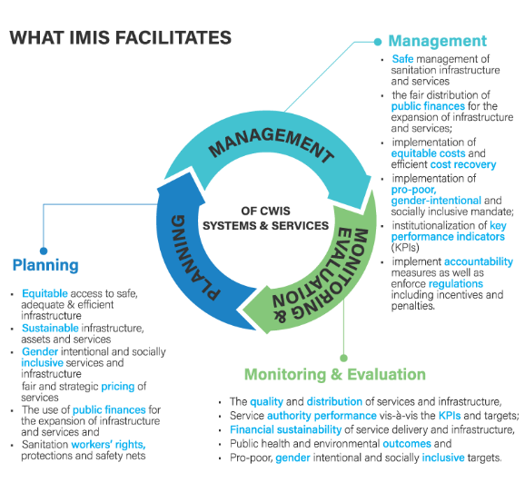

# IMIS Scaling Up Phase II
## Open-Source Base IMIS

**Table of Contents**

[**1.**	**Introduction** ](#_toc189741401)

[**2.**	**Evolution of IMIS**](#_toc189741402)

[**3.**	**Base IMIS V1.0.0**](#_toc189741403)

[*3.1*	*Functional Modules of Base IMIS*](#_toc189741404)

[*3.2*	*Roles and Permissions	18**](#_toc189741405)

[*3.3*	*IMIS Driven Sanitation Service Delivery Chain*](#_toc189741406)

[3.3.1	Entities in IMIS-driven sanitation service delivery model](#_toc189741407)

[3.3.2	Processes in IMIS-driven sanitation service delivery model](#_toc189741408)

[*3.4*	*Technical Stack*](#_toc189741409)

[**4.**	**IMIS Implementation Framework for New Cities**](#_toc189741410)

[**5.**	**Accessing IMIS**](#_toc189741411)

[*5.1*	*Organization Structure**](#_toc189741412)

[*5.2*	*Branch Structure**](#_toc189741413)

[*5.3*	*Version Management**](#_toc189741414)

[*5.4*	*Organization Maintenance**](#_toc189741415)

[**6.**	**License**](#_toc189741416)

[*6.1*	*License Text*](#_toc189741417)

[*6.2*	*Full License*](#_toc189741418)

1. # **Introduction**
   The Integrated Municipal Information System (IMIS) is an open-source GIS-based Digital Public Infrastructure (DPI) that serves as both a municipal information system and a software solution. The IMIS is primarily designed to enhance city’s sanitation system and services; however, it also has capability to assist city in managing and streamlining other urban services. Initially developed as a platform to help managing cities faecal sludge, IMIS has evolved into a robust system that supports in advancing Citywide Inclusive Sanitation (CWIS) and contributes in achieving Sustainable Development Goal (SDG) 6.2. It enables efficient municipal service delivery through real-time data tracking of sanitation service chain, centralized data aggregation, integrated spatial analysis tools, monitoring KPIs and served as a sub-national public data system to manage sanitation data and monitor city’s CWIS indicators.
1. # **Evolution of IMIS**
   The development of IMIS has undergone multiple phases of growth, expanding from its initial scope into a more comprehensive tool.

   **2016-2017:** 

- SNV Bangladesh, under BMGF funded CWIS project, established GIS-based Database of Khulna and Jhenaida in Bangladesh with complete database of sanitation system to support Faecal Sludge Management (FSM) service with the technical support of Innovative Solution Pvt. Ltd. (ISPL). The survey and GIS data preparation work was supported by Khulna University.

**2018-2019:** 

- IMIS was conceptualized as part of the GIS-based FSM Information System development activity of SNV Bangladesh, with ISPL leading the overall project process, including conceptualization, system architecture design, and technical development. The architecture of IMIS was inherited from ISPL’s expertise and prior experience in designing and developing GIS-based Municipal Information System (GMIS) under the ADB-funded SMUSDP project in Nepal. IMIS was developed and implemented in SNV’s two project towns in Jhenaida and Khulna.

**2020-2021:** 

- IMIS was further customized and scaled up across multiple municipalities in Bangladesh by SNV, with the technical support of the local company Streamtech Ltd (STL). ISPL transferred its knowledge and technology to STL, which then engaged in replicating and ensuring the system’s smooth operation.

**2021-2022:**

- IMIS was completely redesigned, restructured, and redeveloped from scratch by ISPL, incorporating capabilities to support the CWIS approach in the overall planning, management, and monitoring & evaluation of sanitation systems and services. 
- The new ISPL version IMIS was implemented in Mahalaxmi Municipality, Nepal, to support ENPHO in implementing ISO 24521.

**2023:** 

- GWSC-AIT, in collaboration with ISPL, initiated the scaling up of IMIS as a public data system for local governments, including the development of a standardized Base IMIS streamlining CWIS approach. Lakxmipur Paurashova in Bangladesh and Birendranagar Municipality in Nepal were selected as pilot towns for implementation.
- A new milestone was achieved with the integration of IMIS and the Electronic Building Permit System (eBPS) in Mahalaxmi Municipality. This integration allows the city to update newly constructed buildings and containment structures in the IMIS building and containment database while ensuring the construction of standard septic tanks.

**2024:** 

- Open-source Base IMIS was developed with built in major 22 CWIS indicators and many additional tools for urban management decision support system. ISPL version IMIS developed in 2021-2022 was taken as the foundation for developing the standard Base IMIS (version 1.0.0)
- An extensive technical training by ISPL in collaboration with GWSC-AIT and ITNBUET was conducted to capacitate local IT companies in Bangladesh to customize and deployment of Base IMIS for localizing and scaling up IMIS in Bangladesh and the region.

**2025:** 

- As a significant milestone in the development of IMIS, the open-source Base IMIS (version 1.0.0) has been released to the public as a Digital Public Infrastructure (DPI) under the Creative Commons Attribution-NonCommercial-ShareAlike 4.0 International (CC BY-NC-SA 4.0) license. It can be downloaded, customized, and used freely.
1. # **Base IMIS V1.0.0**
   Base IMIS is the foundation of the IMIS platform, structured to provide a scalable, open-source, and interoperable solution for local authorities. It typically includes the core features and functionalities of IMIS, which can then be further customized or expanded based on specific municipal needs for their municipal governance and efficient sanitation service delivery. Base IMIS, the open-source GIS-based Digital Public Infrastructure (DPI), functions as both a municipal information system and a software solution, integrating data, processes, and services to enhance municipal governance—particularly in sanitation management in CWIS approach to achieve SDG 6.2. The Base IMIS serves as the foundation offering core features and functionalities that can be customized or expanded to meet the specific needs of municipalities.

   Base IMIS offers municipalities data-driven decision-making tools to strengthen governance across various sectors. By leveraging open-source technologies and Geographic Information Systems (GIS), it facilitates:

- Planning, management, and monitoring of sanitation systems using the CWIS approach.
- End-to-end FSM (Faecal Sludge Management) service chain oversight, including real-time data tracking.
- Generation and visualization of CWIS indicators for performance assessment.
- Intuitive dashboards for tracking CWIS indicators, Key Performance Indicators (KPIs), and other essential municipal governance metrics.

As a sub-national public data system, Base IMIS contributes to national-level monitoring by feeding data into centralized systems, supporting Citywide Inclusive Sanitation (CWIS) indicators and other critical metrics for achieving sanitation targets.

Beyond sanitation management, with its modular and scalable design, Base IMIS empowers local authorities by providing a unified, data-driven framework that enhances efficiency, accountability, and service delivery in municipal governance.

|

*Figure 1 Planning, Management and Monitoring & Evaluation Framework for implementing CWIS Approach*
|
| - |
|IMIS supports the Planning, Management, and Monitoring & Evaluation (M&E) framework for CWIS systems and services (see [Figure 1](#_ref189688225)). This framework emphasizes a structured approach to achieving inclusive and sustainable sanitation outcomes. The Planning component focuses on equitable and gender-inclusive strategies, sustainable financing, and transparent pricing mechanisms. The Management component ensures the safe, accountable, and financially sustainable operation of sanitation systems. The M&E component assesses service quality, equitable distribution, and the performance of sanitation authorities. Together, these components create a continuous feedback loop that helps municipalities refine their strategies and align them with national sanitation goals.|

Built on robust open-source technologies like PHP, PostgreSQL, and OpenLayers, IMIS is made freely available under the **Creative Commons Attribution-NonCommercial-ShareAlike 4.0 International (CC BY-NC-SA 4.0) license**. This licensing ensures that municipalities and stakeholders can access, use, and adapt the system to their needs while promoting collaboration and innovation in sanitation and urban governance
1. ## **Functional Modules of Base IMIS**
   Base IMIS comprises of ten functional modules ([Figure 2](#_ref189688233)), seven of which are core modules to manage sanitation systems and services in CWIS approach, whereas remaining three value-added modules enhance complementary municipal services, including property tax collection, solid waste management, and water supply billing. Combined with the **Urban Management Decision Support System (UMDSS)**—a powerful tool for spatial analysis, mapping, and decision-making—IMIS empowers municipalities to adopt CWIS principles while contributing to broader urban governance.

   The seven core modules include:

- Building Information Management System (BIMS)
- Utility Information Management System (UIMS)
- Faecal Sludge Information Management System (FSIMS)
- Community/Public Toilet Information Management System (CTPIMS)
- Sewer Connection Information Management System (SCIMS)
- Public Health Information Support System (PHISS)
- Urban Management Decision Support System (UMDSS)

The three value-added modules are:

- Property Tax Collection Information Support System (PTCISS)
- Solid Waste Information Support System (SWISS)
- Water Supply Information Support System (WSISS)

Data required for six out of seven core modules (excluding Urban Management Decision Support System) such as buildings, containments, roads, etc. have to be created prior to the implementation of IMIS and migrated in the system. Such data needs to be updated in the IMIS as changes occur, e.g. new buildings constructed in the city after its implementation needs to be updated in the system by the responsible department such as building permit department. If any changes have occurred in the attribute information of the geographical features, they also need to be updated. Service data like the data to be captured in the process of containment emptying, service providers information, etc. will be maintained after implementation of IMIS. The data maintained by the six data models have a direct impact in sanitation related analysis and CWIS indicators. 

The value-added modules primarily support property tax collection, solid waste management, and water supply billing units, utilizing IMIS as a digital infrastructure to enhance services and improve revenue collection processes. Unlike the core modules, these value-added modules rely on data imported from respective municipal departments and units which are created during their regular business processes, as IMIS does not create data for them. There is no direct impact of these data in analyzing sanitation related data and analyzing Citywide Inclusive Sanitation (CWIS) approach. Refer [GIS Data Creation Material](https://github.com/base-imis/additional_resources/blob/master/GIS%20Data%20Creation%20Resource%20Materials/Resource%20Materials%20-%20GIS%20Data%20Creation.pdf) to know more about GIS data creation work and the [Data Dictionary](https://github.com/base-imis/web_app/blob/master/documentations/data_dictionary/data_dictionary.md) know more about the types of data required to be maintained in IMIS.

UMDSS out of seven core IMIS modules do not create data itself, it consolidates data from other modules to facilitate decision-making related to sanitation systems, services, and broader urban management issues through its various analytical tools. Access to these modules is determined by the functional roles of municipal staff, executives, and stakeholders, ensuring their integration into daily municipal operations for effective management.

The use of these modules must be embedded into the regular workflows of corresponding departments or units within the municipality. For instance, the FSTP operator, responsible for recording logs of feacal sludge disposed of at the FSTP, is required to use the “Sludge Collection” functional sub-module within FSIMS. Similarly, emptying operators must use the IMIS-provided mobile application to capture data during containment emptying processes under the relevant sub-modules. This integration ensures that information within IMIS is continuously updated without the need for additional resources dedicated solely to data entry.

Each of these ten functional modules is discussed in detail in subsequent sections of this chapter. Additionally, IMIS includes a dedicated Settings module, which focuses on system administration and is covered at the end of the chapter. This structured approach ensures that IMIS is seamlessly integrated into the municipality’s operational framework, supporting both sanitation and urban management.

*Figure 2 Functional Modules of IMIS*

1. **Building Information Management System (BIMS)**

The BIMS is a core module of the IMIS that serves as a comprehensive database of all buildings within a municipality. It encompasses detailed information about each building, including: Physical attributes (structure type, number of floors, and year of construction); Location details (address and geographical coordinates with building footprints; Usage and ownership (Building usage, ownership status, and associated tax codes); Utilities and services (sources of water, solid waste management services, access to sanitation, access to roads, etc); Demographics and classifications (basic demographic data and classifications for low-income community areas). Buildings are central to IMIS, functioning as the foundational entities that interconnect all other components essential for efficient municipal service delivery.

The building database in IMIS is established using a GIS framework. High-resolution satellite or drone imagery is used to digitize building footprints, which are then verified through field checks and house-to-house surveys. House-to-house survey also collects all other required attributes data about buildings. 

New buildings constructed post-IMIS implementation are recorded through the IMIS mobile application during the building permit process and updated for new constructions. The app, currently available for Android, captures building footprints and related data for new structures. Additional building attributes are updated during municipality’s business process in delivering various services such as sanitation assessments, sanitation service delivery and other services. However, this need to be incorporated in municipality’s service delivery policy. 

BIMS provides interactive dashboard dedicated for building related information. This dashboard provides visual insights into building data from multiple perspectives. BIMS provides comprehensive interfaces and tools for data entry, updates, queries, and analysis. The system has map-based integration feature that provides geospatial visualization tools for location identification. The module has data extraction tools that has capability for generating data in various formats, including CSV, Shapefiles, and KML files.

BIMS offers municipalities valuable insights into Building infrastructure status, utility and service access and the critical data for planning, management and monitoring and evaluation of sanitation system and services in CWIS approach.

The data maintained by BIMS helps municipality to monitor the CWIS indicators such as (i) Ratio of LIC access to population access, (ii) Population with access to safe individual toilets, and (iii) Low income community (LIC) population with access to safe individual toilets.

1. **Utility Information Management System (UIMS)**

**UIMS**, a core module of the **IMIS**, is designed to manage detailed spatial and attribute data for municipal utilities such as roads, stormwater drains, water supply networks, and sewer systems. UIMS plays a critical role in achieving **CWIS** by enabling municipalities to monitor sanitation infrastructure, identify service gaps, and ensure equitable access to sanitation services, particularly for low-income community (LIC) areas. Through its integration with the **BIMS**, UIMS provides granular insights into utility connectivity for each building, including sewer and drainage links, and water supply access. This integration helps municipalities target underserved areas, plan infrastructure expansions, and prioritize investments in sanitation services.

A key feature of UIMS is its interactive dashboard, which delivers real-time visualizations on sanitation-related utilities. The system empowers municipalities to monitor sanitation coverage trends, identify gaps, and make data-driven decisions to address inequities in service delivery. UIMS also includes advanced map-based input tools integrated with the **UMDSS**, allowing municipalities to add or update utility infrastructure directly within the platform. Currently this tool is available for creating and updating road only. In case of other utilities, they need to be digitized and merged with existing data and import in corresponding utilities database of IMIS with the help of skilled GIS people. In case of attribute data, they can be updated for all kind of utilities directly from the user interface. UMDSS has provided tools to export data in flexible formats, such as CSV, SHP, and KML ensuring seamless sharing and integration with other municipal services.

1. **Faecal Sludge Information Management System (FSIMS)**

The FSIMS is another core and most important module CWIS. This module enables municipality to digitalize and manage all data related to sanitation systems and services. FSIMS digitalize the complete sanitation service chain from application request for emptying service to the safe disposal of faecal sludge at the treatment plant and the reuse of the treated waste.

The FSIMS is further categorized into five sub-modules:

1. FSM Dashboard (FSMD): The FSMD provides information related FSM services, overall, from containment emptying to transfer and disposal of waste in the FSTP. FSMD provides information about the number of containments; service providers; resources used for service delivery; applications received and responded; containments emptying status, volume of sludge collected, emptied and disposed; and the revenue generated, 
1. Containment Information Management System (CIMS): The CIMS maintains the information about the containments in the city, with their location information and attribute information such as building identification number (in case of multiple building served one containment, BIN of main building responsible for taking care of the containment), sanitation system type, dimensions, volume, last emptying date, next emptying date, etc. If a building is connected to a sewer network, that information is maintained in the building database. However, this module does not include a separate feature for adding new containments, if new containment must be added, it has to be updated in corresponding building in building database, through BIMS. A containment may be shared by multiple buildings or vice versa.
1. Service Provider Information Management System (SPIMS): The SPIMS maintains the information related to the sanitation service providers registered with the city that provide emptying services within the city. This information is maintained by municipal authority whereas, two other functionalities employee information and desludging vehicles for service provider to maintain their information about their employees and the desludging vehicles. Only those service providers, employee and vehicles registered in this system are eligible to provide emptying, transporting and disposing faecal sludge in the FSTP or area designated by the municipality. These information help municipality and service provider for efficient management of the resources and efficient service delivery. The information provided by SPIMS also helps monitoring KPIs set by municipality for service provider and tracking emptying vehicle to ensure that the waste emptied from the containment is transported and disposed in the area designated for disposing waste or FSTP allocated by the municipality.
1. Treatment Plant Information Management System (TPIMS): The TPIMS maintains the information related to the treatment plants that could be FSTP, Centralized Wastewater Treatment Plant, Decentralized Waste Water Treatment Plant or Co-treatment Plant, those used by the city to dispose and treat collected faecal sludge or waste water. In addition to this, this sub-module also maintains water sample test data with the standard parameters used for monitoring the performance of the treatment plants in the city. 

   The information maintained by TPIMS along the information maintained by BIMS and the ESIMS, helps municipal to monitor the CWIS indicators such as (i) FS treatment capacity as a % of total FS generated from non-sewered connections, (ii) FS treatment capacity as a % of volume disposed at the treatment plant, (iii) WW treatment capacity as a % of total WW generated from sewered connections and greywater and supernatant generated from non-sewered connections, and (iv) Effectiveness of FS treatment in meeting prescribed standards for effluent discharge.

1. Emptying Service Information Management System (ESIMS): The Emptying Service IMS digitalizes the sanitation service chain and enables the city to manage the entire sanitation service chain, starting from application requests for emptying service from the customer to the safe disposal of feacal sludge at the treatment plant. All the activities involved in this process can be monitored in real-time through ESIMS. The module is divided into four categories according to the different stages of the sanitation service chain i.e. application, emptying, sludge collection and feedback. The complete service chain is managed and maintained through the application section; however, the individual sections maintain further detailed information. There are several functional modules under this sub-module: 
- Application – this functional module is accessible to helpdesk and FSTP operator. The helpdesk use it for receiving and maintaining application for customer’s emptying request and collecting and maintain feedback data. FSTP operator use it for updating sludge transferred from the emptied containment and disposed in the FSTP. There is a function to generate report of emptying service under this functional module. Helpdesks generally are the part of the municipality’s sanitation department, emptier are part of the service providers and FSTP operators can be part of the municipality or the private operator as of municipality’s policy.
- Emptying – there is an easy-to-use native mobile application (android) that allows collection of the emptying information while providing the emptying service, such information can be updated in real-time. The mobile application is used by emptier to collect the information such as emptying start and end time, number of trips, total cost for emptying, and the payment receipt number. Emptying details can be viewed in real-time by help desk and other municipal staff who has access to this module.
- Sludge collection – FSTP operator in FSTP updates the FS disposal record that includes date, time and volume of waste disposed in the FSTP through the functional module Application through the web app as the waste is transferred and disposed in FSTP. Help desk can view these records in real-time through this functional module.
- Feedback – this functional module is accessible to the helpdesk, after completing sanitation service chain from emptying to disposal of the waste in the FSTP. 
- Help desks – this functional module is used to create help desk and update their information. Help desk generally are under municipality itself, but the system has capability of managing multiple help desks.

Data maintained by FSIMS along with the building data and LIC data enables CWIS Information Management System to generate CWIS indicators such as (i) IHHL onsite sanitation system that have been desludged, (ii) Collected FS disposed at the treatment plant or designated disposal site, (iii) Low income onsite sanitation systems that have been desludged, (iv) FS collected from LIC that is disposed at treatment plant or designated area, (v) Educational institutions where FS generated is safely transported to TP or safely disposed in situ, (vi) Healthcare facilities where FS generated is safely transported to TP or safely disposed in situ, and (vii) Desludging services completed mechanically or semi-mechanically.

The data export tools under FSIMS allow users to export data in CSV, Shape and KML format where applicable.

1. **Community Toilet / Public Toilet Information Management System (PTCTIMS)**

The PTCTIMIS is another core module of the system that maintains the information about the Public Toilets (PT) and Community Toilets (CT) in the city. The module enables municipal authority to maintain geographic locations of the PTs and the CTs in the city with their capacities and facilities along with daily user logs in case of PTs. In case of CTs, PTCTIMS maintains the number of households and the population served by CTs, based on the household and population data maintained by building database in the system. Data export feature of the module enables users to export data PT/CT data in CSV format. Mapping features of UMDSS with this data enables municipal authorities to map the locations of the PTs/CTs with their operational condition and it has also provided a tool to map the buildings which are served by a specific CT.

CT information along with building information maintained by PTCTIMS helps monitoring four major CWIS indicators (i) Dependent population with access to safe shared facilities, (ii) Shared facilities that adhere to principles of universal design, (iii) Shared facility users who are women, and (iv) Average distance from household to shared facility. Similarly, PT information along with containment emptying data enables municipal authority to monitor CWIS indicators (i) PT where feacal sludge generated is safely transported to treatment plant or safely disposed in situ, (ii) PT that adhere to principles of universal design, and (iii) PT users who are women.

1. **Sewer Connection Information Support System (SCISS)**

The SCISS is a core module that enables the city to maintain information on new sewer connections established between a building and sewer network within the city. This module provides a native mobile application (android) that allows the collection of the unique ID of both the building and the corresponding sewer network through a field survey. The collected building ID as well as sewer ID are maintained by this module, and once approved it is reflected in the BIMS, which updates the sanitation system and utility information of the building.

1. **Public Health Information Support System (PHISS)**

PHISS is another core module of the IMIS, designed to empower municipalities in monitoring and addressing public health and sanitation challenges. PHISS enables the collection and maintenance of water sample data from various sources, including groundwater, surface water, and treated wastewater, to ensure compliance with water contamination standards. This functionality directly aligns with the CWIS objective of monitoring environmental outcomes associated with sanitation systems. Additionally, PHISS records and tracks cases of waterborne diseases across the city, providing municipalities with crucial data to understand and mitigate public health risks.

One of the standout features of PHISS is its ability to maintain spatial and attribute data related to hotspot areas where waterborne diseases, such as diarrhea, cholera, dysentery, and typhoid, have been detected. The system also tracks fatalities linked to these diseases, offering a comprehensive overview of the impact on affected households and populations. By integrating this information with the UDSS municipal authorities can conduct detailed analyses of disease prevalence and its underlying causes. This data-driven approach enables strategic planning, targeted interventions, and efficient allocation of resources to reduce health risks in vulnerable areas.

Water sample data and waterborne cases data maintained by PHISS helps municipality to monitor the CWIS indicators (i) Water contamination compliance of the water sources such as groundwater, surface water and treated wastewater, and (ii) Incidence of feacal-oral pathway diseases (e.g. diarrhea, cholera, dysentery and typhoid). With this information, municipalities can assess the effectiveness of sanitation systems in protecting public health and identify areas requiring urgent attention. By addressing these indicators, PHISS supports municipalities in achieving CWIS objectives, ensuring safe water quality and reducing the prevalence of sanitation-related diseases. The data export tools under PHISS allows users to export data in CSV, Shape and KML format where applicable.

1. **Urban Management Decision Support System (UMDSS)**

The UMDSS is one of the core and powerful tool in IMIS, it provides advanced capabilities for spatial analysis, mapping, data export, and dashboard visualizations. These tools empower city authorities to engage in evidence-based planning, management, monitoring, and decision-making for planning, management and monitoring and evaluation of sanitation system and services as well as a broader municipal urban management activities. In addition to the UMDSS module, there are IMIS Dashboard, Building Dashboard under BIMS, FSM Dashboard under FSIMS, Utility Dashboard of IMIS, CWISIMS Module including CWIS and KPI dashboard under CWISIMS are also has been considered as the components of UMDSS.

**7.1 UMDSS**

The UMDSS provides Export Data and Map Feature Sub-modules.

Export Data:

- The Export Data sub-module enables users to export data layers in flexible formats such as SHP and KML. Users can customize exports by selecting specific ward(s) or combining layers to suit their needs.

Map Feature:

- The Map Feature is a powerful interactive map interface which provides a dynamic platform to visualize and analyze spatial data created by various modules and sub-modules in IMIS. It displays all spatial information with categorical styling based on attribute inforation, presenting summarized layers at city, ward and 0.5 km grid levels. 
- The interface includes various spatial and complex tools provide both basic and advanced functionalities, catering to a wide range of municipal operations. From navigation and visualization to sanitation-specific analyses and data updates, these features enhance decision-making by offering precise and actionable insights. These tools are – (i) Navigation and Map Interaction Tools (Zoom In & Zoom Out, Municipal Extent, Navigate, Info,  Coordinate Information, Locate Point by Coordinate, Measurement Tools, Measure Distance, Measure Area, (ii) Measurement Tools (Measure Distance, Measure Area), (iii) Printing and Support Tools (Print Map, Help), (iii) Sanitation-Specific Analysis Tools (Find Nearest Road, Find Building Connected to Containment, Find Containment Connected to Building, Find Associated Building, (iv) Editing Tools (Add Roads, Remove Markers)

  The integration of tools like Find Nearest Road and Containment Analysis directly supports Citywide Inclusive Sanitation (CWIS) goals, while features like Measure Area, Print Map, and Add Roads contribute to broader urban management and planning efforts. By using these tools, municipal authorities can efficiently monitor sanitation systems, plan infrastructure upgrades, and ensure equitable service delivery across the city.

- UMDSS also offer some specialized tools – (i) Service Delivery Tools for tracking (Applications, Emptied Applications Not Reached to Treatment Plant, Containments Proposed to Be Emptied, Feedback Chart (FSM Service Quality), (ii) General Tools for tracking (Buildings by Structure Type, Property Tax Collection, Water Supply), (iii) Data Export Tools (Filter by Wards, Export Data Set, Building Owner Information), (iv) Decision Tools (Tax Due Buildings, Sewers Potential Buildings, Buildings to Sewer, Buildings to Road, Hard to Reach Buildings, Building Close to Water Bodies, Buildings Using Community Toilets, Area Population), (V) Summary Information Tools (Summary Information Buffer Filter, Water Bodies Buffer Summary Information, Wards Summary Information, Road Buffer Summary Information, Point Buffer Summary Information).

  These tools enhance decision-making by providing targeted insights into property, utility, and demographic data. They allow municipalities to analyze specific areas, prioritize interventions, and support efficient planning, management and monitoring and evaluation of CWIS sanitation system and services, and overall urban management. 

  2. ` `**CWIS Information Management System (CWISIMS):**

CWISIMS is a vital module of the **IMIS** that provides tools to generate CWIS indicators for the city and Key Performance Indicators (KPIs) to monitor the performance of sanitation service providers for a specified year. CWISIMS allows municipalities to set targets for each indicator in alignment with city policies and standards, and it includes a dashboard for the visualization of these indicators. The generated indicator data is maintained in a database, enabling easy access and review when needed, ensuring effective monitoring and planning.

1. CWIS Dashboard - The CWIS Dashboard tracks 22 sanitation indicators ([more information here](https://github.com/base-imis/additional_resources/blob/master/CWIS%20Indicators%20in%20IMIS.pdf)), which are generated annually. These indicators are calculated by data maintained across various modules and sub-modules within IMIS, making them integral to understanding citywide sanitation performance. The indicators are based on the CWIS framework developed by Athena Informatics, ensuring consistency with globally recognized standards for inclusive sanitation monitoring. This dashboard provides municipalities with a centralized platform for tracking sanitation progress and assessing the effectiveness of implemented policies and services.
1. KPI Dashboard – The KPI Dashboard complements the CWIS Dashboard by focusing on the performance of sanitation service providers. It monitors seven critical KPIs (1.Application Resposne Efficiency, 2. Customer Satisfaction, 3. PPE Compliance, 4. Safe Desludging, 5. Faecal Sludge Collection Ration, 6. Resonse Time, 7. Inclusion), which are also generated annually, using sanitation service data related to faecal sludge management (FSM) service delivery. These KPIs are designed to evaluate the efficiency and quality of services provided by sanitation operators, based on metrics developed by SNV Bangladesh. By leveraging this dashboard, municipalities can benchmark service provider performance and identify areas for operational improvement within their sanitation systems.

CWISIMS, through its dual focus on CWIS indicators and KPIs, provides municipalities with robust tools for monitoring and improving their sanitation systems. By aligning indicator and KPI tracking with international standards and municipal goals, it ensures data-driven decision-making and continuous improvement in sanitation service delivery and management.

2. **Dashboards**

There are all together six Dashboards considerd as the components of UDSS of the IMIS includes six dashboards that serve as its core components: (i) IMIS Dashboard, (ii) Building Dashboard, (iii) FSM Dashboard, (iv) Utility Dashboard, (v) CWIS Dashboard, and (vi) KPI Dashboard. Five of these dashboards have been discussed under their respective functional modules and sub-modules. The remaining dashboard, the IMIS Dashboard, is detailed below.

The IMIS Dashboard serves as the central platform within the IMIS, offering a comprehensive overview of municipal data. It integrates information on building infrastructure, utilities (such as roads, drains, sewer, and water supply), sanitation systems and services, public and community toilets, public health, tax collection, water bill payments, and solid waste management. This dashboard provides municipalities with a unified interface for monitoring and managing citywide operations effectively, supporting informed decision-making and efficient service delivery.

The Urban Management Decision Support System (UMDSS) enables municipalities to implement Citywide Inclusive Sanitation (CWIS) principles, supporting the planning, monitoring, and management of sanitation systems and services through a CWIS-focused approach. It also enhances revenue collection processes, including tax collection, water bill payments, and fees for solid waste management services, while providing actionable spatial insights to improve overall urban management. With its powerful analytical tools, UMDSS empowers municipalities to achieve greater efficiency, transparency, and inclusivity, not only in sanitation management but also in broader urban governance and service delivery.

1. **Property Tax Collection Information Support System (PTCISS)**

PTCISS is a value-added module integrated into the IMIS, designed to help municipalities monitor and manage property tax collection citywide through powerful map-based visualization tools. It enables city authorities to import property tax data maintained by the municipal property tax collection department into IMIS using a user-friendly data import tool supporting CSV formats. Once the data is integrated, property tax collection information is displayed in graphical formats on the IMIS dashboard and visualized on maps using tools provided by UMDSS. This facilitates quick and intuitive analysis of tax collection status across various parts of the city.

Mapping property tax data provides actionable insights by identifying high-default areas (regions with a significant number of defaulters) and efficient collection zones (areas with fewer defaulters or higher compliance rates). These insights enable the property tax department to focus on areas requiring attention, thereby improving efficiency and compliance. The information generated by PTCISS empowers city authorities to engage in strategic planning and evidence-based decision-making, allowing them to: (a) develop better tax collection strategies, (b) formulate effective policies to increase compliance, and (c) plan for equitable tax management across different city regions.

PTCISS also includes Data Export Tools, enabling municipal authorities to export building data along with their tax payment status. Additionally, it highlights mismatched tax records between the building data maintained in IMIS and the input tax data provided by the property tax department. This functionality helps identify and resolve discrepancies, ensuring data accuracy and transparency.

Currently, PTCISS relies on periodic manual updates using CSV-based imports to maintain data accuracy. However, the system is designed to be future-ready, with the capability to support real-time data integration through an API if the city’s property tax collection system provides connectivity access. This upgrade would enable automated and efficient data synchronization as municipal technology evolves.

By leveraging the features and insights provided by PTCISS, municipalities can streamline property tax management, improve transparency, and enhance revenue collection efficiency. These improvements contribute significantly to better urban governance and equitable service delivery.

1. **Solid Waste Information Support System (SWISS)**

The SWISS that enhances the management of solid waste services and fee collection. The module includes a tool for importing a municipality’s solid waste customer data, including their last solid waste management service fee payment date, in CSV format. Based on this imported data, the SWISS module generates and maintains solid waste management customer records in IMIS, along with their fee payment status. It also provides tools to export building data with their solid waste service fee payment status and identifies discrepancies by highlighting records that exist in the municipality’s solid waste customer database but are missing from IMIS.

Using the imported data, UMDSS in IMIS helps municipal authorities map buildings with or without solid waste management services and their respective fee payment statuses. This mapping capability enables municipalities to monitor service coverage, assess the status of fee collections, and identify geographic trends in solid waste management service delivery. By integrating solid waste management customer data with building records in IMIS, the SWISS module equips municipal authorities with actionable insights to make informed decisions regarding solid waste services.

The visualized data provided by SWISS supports municipalities in formulating policies to enhance the solid waste management service and fee collection processes. It also aids in optimizing resource allocation and improving overall service delivery by identifying areas requiring attention or adjustments. This integration is currently carried out manually on a periodic basis to ensure the data in IMIS remains up-to-date. Like the PTCISS module, SWISS does not yet support real-time data integration through an API.

1. **Water Supply Information Support System (WSISS)**

The WSISS is another value-added module within the IMIS, designed to enhance the management of water supply services and fee collection. The WSISS includes a data importing tool that allows municipalities to upload water supply customer data, including their last fee payment date, in CSV format. Based on this imported data, the WSISS module generates and maintains records of water supply customers along with their fee payment status. It also provides tools to export building data with their water supply service and fee payment statuses and highlights discrepancies by identifying records present in the municipality’s water supply customer database but missing in IMIS.

Using the imported data, the UMDSS in IMIS enables municipal authorities to visualize the water supply fee payment status of buildings in maps of the City within IMIS. This capability allows municipalities to monitor fee collection statuses and assess geographic trends in water supply fee payments. By integrating water supply customer data with building information in IMIS, the WSISS module equips municipal authorities with actionable insights to make informed decisions regarding water supply services.

The visualized data provided by WSISS supports the development of policies aimed at improving water supply fee collection processes, optimizing resource allocation, and enhancing overall service delivery. This integration helps municipalities target areas requiring attention, ensuring more effective and equitable water supply service management.

Currently, as with the PTCISS and SWISS modules, the integration of data into WSISS must be carried out manually on a periodic basis to maintain accuracy.

1. ` `**Settings**

This is a module to allows administrators to manage user access and control permissions within the system. Features includes : 

User Credentials - **s**ecurely store and manage user authentication details, including usernames, passwords options.

Roles Management- Create and assign roles to users, defining their access level and responsibilities. Roles can be customized to reflect specific job functions.

Permissions Control - fine-tune access by assigning permissions to roles or individuals, ensuring users can only interact with data and features relevant to their role.
1. ## **Roles and Permissions**
   The IMIS is equipped with pre-defined roles and permissions within the system that govern the extent to which the modules and their functionalities can be accessed. This role-based approach ensures visibility of modules, tools and features according to the responsibilities assigned to the role. The pre-defined roles can be easily updated and modified as per the requirements of the city through the Settings section of IMIS, and new roles beyond the pre-defined ones can be added as well. 

   The pre-defined roles are categorized according to the type of user. The IMIS has been developed with 5 different types of users and 17 pre-defined roles categorized within the user types:

1. Municipality
   1. Municipality - Super Admin
   1. Municipality - Executive
   1. Municipality - Building Permit Department
   1. Municipality - Building Surveyor
   1. Municipality - Infrastructure Department
   1. Municipality - Tax Department
   1. Municipality - Water Billing Unit
   1. Municipality - Solid Waste Management Department
   1. Municipality - Sanitation Department
   1. Municipality - IT Admin
   1. Municipality - Public Health Department
   1. Municipality - Help Desk
1. Service Provider
   1. Service Provider – Admin
   1. Service Provider - Emptying Operator
   1. Service Provider - Help Desk	
1. Treatment Plant
   1. Treatment Plant - Admin
1. Help Desk
   1. Municipality - Help Desk
   1. Service Provider - Help Desk	
1. Guest
   1. Guest

For detailed role and permission setup, refer to the [Roles & Permission Matrix](https://github.com/base-imis/web_app/blob/master/documentations/code_documents/18%20-%20Roles%20%26%20Permission%20Matrix.md). 
1. ## **IMIS Driven Sanitation Service Delivery Chain**
   IMIS digitalizes the entire sanitation service delivery chain, enabling cities to efficiently manage each stage—from customer requests for emptying services to the safe disposal of fecal sludge at treatment plants. The sanitation service delivery model described below is currently implemented in IMIS. However, when deploying IMIS in new cities, customization may be required to align with the specific requirements and needs of the city. This component of IMIS—the sanitation service delivery model—is one of its strongest features, providing a comprehensive software solution that manages the entire service delivery chain. It offers a holistic approach to sanitation service management, ensuring efficiency, transparency, and accountability throughout the process. The IMIS-driven sanitation service chain, as currently implemented, is illustrated in [Figure 3](#mergeformat).

   

   *Figure 3 IMIS driven sanitation service delivery chain*
   1. ## **Entities in IMIS-driven sanitation service delivery model** 
      There are six key entities in IMIS driven sanitation service model as discussed below: 

1. **Customer** – The customer is the person who owns or resides in the building where the containment emptying service is required. Customer is responsible for requesting containment emptying service, receiving service, and paying a service fee to the service provider. Customer is also responsible for providing feedback, when contacted by help desk after the emptying service is completed. 
1. **Help desk (HD)** –The HD is a key interface between customers and the SP. It receives applications from customer for emptying containment, logs the application in IMIS and assigns work to SSP. The HD receives applications through a dedicated central hotline or in person at the HD office. 

   The HD is also responsible for collecting feedback from the customers and supporting on other aspects of FSM such as collecting and redressal grievances, advising on septic tank designs, and providing information on trained masons and different other sanitation-specific inquiries. The HD can be a part of the sanitation section of the city established on its premises or it can be a part of the service providers themselves.  

1. **Service Provider (SP)** – SP is responsible to take job orders from the help desk for emptying service, scheduling the service delivery date and time in consultation with the customer, and mobilize the ETO for emptying. SP must also maintain information about the emptying service provider, all human resources and infrastructure used in delivering services in IMIS.
1. **Emptying and Transport Operator (ETO) –** ETO is a team of driver and helpers and are a part of the service provider that are mobilized in the site for containment emptying. ETO is responsible for emptying containment, transporting and disposing collected FS in the FSTP designated by the city, collecting and updating information required after containment emptying through a mobile app provided for this purpose.**  
1. **Fecal Sludge Treatment Plant Operator (FSTPO)** - FSTPO is a staff member of an entity operating the FSTPO. The FSTPO updates daily sludge collection details, and lab reports on treated effluents and co-composting in IMIS. 
1. **Sanitation Department** – Sanitation Department is responsible for overall monitoring and management of sanitation service using IMIS that includes monitoring of Help Desk, SSP, ETO, FSTPO; and generating reports and submitting them to concerned agencies and departments. 
   1. ## **Processes in IMIS-driven sanitation service delivery model**
      There are eight key processes involved in the IMIS-driven sanitation service delivery model in Faridpur – a) Process Application, b) Process Work Order, c) Maintain Sludge Disposal Record, d) Feedback Record e) Maintain Co-Composting Sales Record f) Maintain Quality Testing Record g) Submit Reports and h) CWIS Indicators Reporting.  

1. **Process Application**

**A1. Request for emptying service** -The Customer initiates the process by requesting emptying service to the HD through a help-line number or, in-person when their containment (septic tank/pit/ holding tank) requires emptying. Related information collected from the customer includes address of the building (Street Name/ Code, House Number/ BIN and ward number), applicant details (name, gender and contact information), application details (proposed emptying date and emergency desludging status). The HD assigns an appropriate registered service provider as well then submits the emptying application in IMIS which is automatically forwarded as a work order to the SSP, including the application registration code. 

1. **Process Work Order** 

**B1. Receiving work order** – The SSP receives auto generated work order in both the web and mobile application with application code and details. The SP calls the corresponding customer and confirms the emptying date, time, and updates application information in IMIS if required. IMIS automatically generates and forwards the application code and the customer’s contact number to the ETO through the IMIS mobile application. 

**B2. Emptying process** – The ETO empties the containment and updates emptying details through the mobile app in IMIS. IMIS provides real time updates to both the SP and HD on the information submitted through the field. In case of multiple trips required, the ETO updates emptying details after completion of all trips and the FSTP operator get notified about the forthcoming arrival of the vacutug after emptying the first trip.    

1. **Maintain Sludge Disposal Record** 

**C1. Sludge disposal record** – The FSTPO logs records of information of sludge disposal at the FSTP in IMIS. Information such as vehicle number, vehicle capacity, arrival time, treatment plant ID where the sludge is disposed are collected in IMIS. IMIS provides real time updates to the SP and the HD about the completion of sludge disposal work. 

1. ` `**Maintain Feedback Record** 

**D1. Feedback record** – After receiving the emptying service completion message in IMIS from ETO and FSTPO, the help desk calls customer for collecting feedback about the emptying service. Collected feedback are updated in IMIS. 

1. **Maintain Quality Testing Record**  

**E1. Effluent test record** - The FSTPO periodically collects a sample of the final effluent and performs a treatment efficiency test with help of a lab. The FSTPO updates the effluent test report in IMIS. The original lab report is sent to the Sanitation Unit. This enables the Sanitation Unit to monitor the quality of effluent to assess the treatment effectiveness of the FSTP through IMIS. 

1. **Submit Reports** 

**F1. Sanitation Services report** – The sanitation unit generates the monthly report of the sanitation services provided directly through IMIS and submits to the appropriate authorities and departments as needed. 

**F2. KPI report** – The sanitation unit generates the yearly KPI report directly through IMIS and submits to the appropriate authorities and departments as needed. 

**F3. Application report** – The sanitation unit generates the individual application report directly through IMIS and submits to the appropriate authorities and departments as needed. 

**F4. FSTP operation report** – The sanitation unit generates a monthly metrics on FSTP operation information (records of sludge disposal and information on drying beds use for sludge disposal) directly through IMIS and submits to the appropriate agencies and department as needed.  

1. **CWIS indicators**  

**G1. Generate CWIS indicators** – The sanitation unit generates yearly CWIS indicators of the city and submits to concerned agencies and departments at the end of the year. However, authorised users with access to IMIS can view these records on the CWIS indicators dashboard or generate them as needed. 
1. ## **Technical Stack**
   IMIS is developed with a PHP backend utilizing the Laravel framework to manage core business logic, API development, and database interactions. The frontend is built using HTML5, CSS3, and JavaScript (ES6+) to create dynamic UI components and a responsive user interface. Bootstrap is integrated to ensure responsiveness across various devices. IMIS uses PostgreSQL as its relational database, enhanced with the PostGIS extension for spatial data processing, which is essential for the platform's spatial visualization and analysis tools.

   GeoServer, deployed on Apache Tomcat, is used to render and serve spatial data layers. It integrates with PostGIS to provide efficient map rendering and data visualization, serving spatial data through Web Map Services (WMS) and Web Feature Services (WFS) for interactive mapping. OpenLayers is employed on the frontend for the map interface, facilitating interaction and visualization of spatial data. The integration between GeoServer and OpenLayers enables IMIS to display real-time, dynamic maps with fast spatial data rendering.

   

   IMIS is containerized using Docker, allowing for streamlined deployment on Linux OS (Ubuntu 22.04). Docker Compose is used to orchestrate containers, with the application running on virtual machine (VM) instances and Nginx acting as the reverse proxy and web server. NPM handles package management for JavaScript libraries and frontend dependencies, while Composer manages Laravel framework dependencies.

   Various third-party libraries and packages are integrated to enhance functionality, including DataTables for displaying large datasets on the frontend, DomPDF for PDF generation, MapFishPrint for map printing, and AdminLTE for dashboards and navigation panels. The codebase is version-controlled using Git, with repositories organized within a GitHub organization structure, further detailed in Section 5.

1. # **IMIS Implementation Framework for New Cities**
   The successful implementation of IMIS in a new city requires systematic planning, coordination, and adherence to structured processes. The following outlines the recommended approach for deploying IMIS in a new city:

1. **Understanding IMIS: Features, Functions, Capabilities, and Strengths**

Before implementing IMIS in a new city, the team responsible must have a comprehensive understanding of the system, including its features, functions, and capabilities. A thorough knowledge of IMIS is essential to ensure successful deployment and effective utilization. The team should familiarize themselves with why IMIS was developed, the modules it comprises, the features it offers, and the types of information it manages. This foundational understanding is critical for aligning IMIS with the city's requirements and ensuring a seamless implementation process. To support this, several resource materials are available, including the IMIS website, the Base IMIS Document, the IMIS Brochure, the IMIS Banner, and the IMIS Orientation Presentation. These materials provide detailed insights into the system and serve as essential references during implementation. Additionally, if further clarity is required, the team can request a live demo through the IMIS website to gain a more practical understanding of the system.

1. **Readiness Assessment & Requirement Analysis** 

The readiness assessment & requirement analysis is a crucial component for the implementation of IMIS in a new city. This step is carried out through multiple interactions with the city officials and concerned stakeholders, as the output of this analysis drives the customization and implementation of IMIS. The following activities are recommended to be carried out to ensure the city officials understand the IMIS, and the team responsible for implementing IMIS can understand the requirements of the city. 

1. **Orientation of City Officials:**
- Conduct orientation session(s) for city officials to introduce the IMIS, highlighting its features, functions, and capabilities. Utilize existing resources provided in [GitHub](https://github.com/base-imis/additional_resources/tree/master) to ensure that officials fully understand the strengths and potential of the system.
- Ensure the city is informed of the following policy directives necessary for the successful implementation of IMIS: 
  - Clear separation of authority(s) and responsibility(s) among the different units/departments, divisions and the other stakeholders) regarding
  - A detailed chain of command regarding the process of collecting, transporting, disposing, treating, and reuse of disposed waste.
  - Basic standard, qualification, and/or experience for all human resource(s), as well as equipment(s) being used in overall sanitation chain
  - Process of mandatory data collection from the end user, as well as data entry schedule and procedure(s).
  - A standard KPIs for all internal and external parties involved in the complete sanitation service chain.
  - CWIS indicators for monitoring and evaluation of CWIS.
- During the orientation session(s), obtain confirmation from the city leadership to proceed with the implementation of IMIS.
1. **Conduct the readiness assessment**

The IMIS readiness assessment must be conducted based on the IMIS Readiness Framework provided in [GitHub](https://github.com/base-imis/additional_resources/blob/master/Resource%20Materials%20for%20Readiness%20Assessment.pdf). The IMIS readiness assessment is a structured evaluation process designed to assess the city’s readiness for implementing IMIS to enhance planning, management, and monitoring and evaluation of sanitation systems and services, following the Citywide Inclusive Sanitation (CWIS) approach. IMIS readiness assessment serves as a valuable feasibility analysis tool to make informed decisions about IMIS implementation for developing investment plan, strategies to mitigate potential obstacles or challenges that may arise in the process of implementing IMIS. Three distinct aspects of readiness are assessed, each of which holds equal importance.

- Data readiness- This component studies the existing availability of data and information in the city, enables to identify the data gaps and develop strategies and methodologies to collect the data either through secondary sources or a GIS-based census survey.
- ` `e-Governance Initiatives and IT readiness: This component studies the existing e-governance initiatives of the city, evaluates the readiness of the city in terms of IT infrastructure and capacity of the officials to migrate to digital systems. This section provides insight into the extent of capacity building activities that shall be required to familiarize the city officials with digital systems. 
- ` `IMIS-driven sanitation service delivery readiness: This component studies the city’s existing sanitation service delivery model, identifying key entities and business processes currently implemented. Based on this study, the study team must develop and propose a revised, IMIS-driven model that aligns with the city's needs and operational environment. The proposed service delivery model must be shared with the concerned officials and finalized.
1. **Propose New Modules & Develop Update Mechanisms:**
- Study the city’s planning, management, and monitoring & evaluation requirements, and propose new modules that will not only address these needs but also enhance the capabilities of IMIS to better serve the city’s objectives.
- The initial dataset is developed through a census survey, but continuous updates will be required once the system is implemented. To facilitate this, study the workflows of key departments in the city, such as the Building Permit Department, Infrastructure Department, and Tax Departments, to create efficient update mechanisms for the information stored in the seven core modules of IMIS. Based on this analysis, propose new strategies and workflows that seamlessly integrate the data update process into the IMIS. As much as possible, the update mechanisms should be embedded within the city’s existing business processes to minimize additional workload. Additionally, propose suitable data collection tools for capturing spatial data, if necessary.
1. **Customization Requirements**
- **Develop a Detailed Customization Document:** Create a comprehensive document that outlines the city-specific customization requirements for the Integrated Municipal Information System (IMIS). This document should be based on the findings of the readiness assessment and should clearly define the necessary modifications and enhancements needed to tailor the system to the city’s unique needs.
- **Determine the Level of Customization:** Assess the level of customization required for the IMIS system to ensure it effectively addresses the city's specific requirements. This involves identifying key functionalities that need to be added, modified, or enhanced to ensure the system aligns with the city’s operational processes, regulations, and goals. The document should provide a clear roadmap for implementing these changes.
1. **GIS Data Creation Process**
- **Study Existing Data Situations:** Based on the readiness assessment, review the current data to understand the existing spatial and attribute information. Based on this review, identify the necessary data to be collected. This includes both spatial data (geographic coordinates, mapping layers, etc.) and attribute data (descriptive information related to the spatial data). Additionally, define the specific data layers required for the GIS system. Refer to the [data dictionary](https://github.com/base-imis/web_app/tree/master/documentations/data_dictionary), [survey questionnaire](https://github.com/base-imis/other_resources/blob/main/Building%20Questionnaire.pdf) and [GIS Data Creation Resource Materials](https://github.com/base-imis/additional_resources/tree/master/GIS%20Data%20Creation%20Resource%20Materials) for further information.
- **Data Collection Tools and Survey Development:** Develop the necessary tools for data collection, including survey questionnaires. These tools should be designed to capture both spatial and attribute data accurately. Once developed, conduct the survey to gather the required data for GIS creation.
- **Data Cleaning and Processing:** After collecting the data, perform data cleaning to remove any inconsistencies, inaccuracies, or incomplete entries. The cleaned data should be processed according to the specifications outlined in the [data dictionary](https://github.com/base-imis/web_app/tree/master/documentations/data_dictionary). This ensures that the data is correctly formatted and ready for migration and integration into the GIS system.
1. **Customization of IMIS**
- **Create GitHub Organization and Repository:** Establish a new GitHub organization specifically for the city based on the existing [GitHub organization](https://github.com/base-imis). Create a replica of the existing GitHub organization to ensure a separate customized version of each document is maintained.
- **Deploy IMIS Locally for Development and Customization:** Set up a local deployment of IMIS with the provided database. Follow the deployment documentation provided in [GitHub](https://github.com/base-imis/deployment_documentation). This environment will serve as the foundation for development and customization efforts.
- **Import Data:** Import the processed data collected through primary and secondary sources into the newly deployed IMIS instance, ensuring that the imported data aligns with the system's structure and supports the forthcoming customizations.
- **Customization** and **Development of New Modules:** Customize the system and develop new modules as outlined Customization Requirements. This includes adapting the IMIS platform to the city's specific needs, while ensuring that new functionalities are seamlessly integrated.
- **System Testing:** Conduct thorough testing to confirm that all existing and newly developed features function as expected. This ensures that the system remains operational and reliable post-customization.
- **Key Customization Considerations**
  - **Maintain Linkages with Building IMS:** Ensure that the existing linkages between the Building Information Management System (IMS) and other systems remain intact during customization.
  - **Preserve Relational Database Structure:** Ensure that the relational database structure of the system is preserved and not disrupted by new customizations.
  - **Integrate New Modules with Existing Ones:** New modules should be integrated with the existing modules wherever possible to ensure interoperability and prevent the creation of isolated, siloed systems.
  - **Impact Analysis for Customization:** Perform in-depth impact analysis before carrying out any customization. This ensures that modifications do not negatively affect the functionality of other modules, with particular attention given to the Urban Management Decision Support System (UMDSS).
  - **Incorporation of Spatial Information:** Integrate spatial information as extensively as possible, ensuring that the newly maintained spatial data is accessible within the Urban Management Decision Support System (UMDSS).
- **Update Technical Documentation:** Ensure that all [technical documentation](https://github.com/base-imis/web_app/tree/master/documentations) is updated to reflect the changes made during the customization process. This includes providing accurate documentation of the source code, database changes, and any adjustments to the system's architecture.
- **Update User Manuals and Existing Documentation:** Revise the [user manuals](https://github.com/base-imis/user_manual) and other documentation based on the customizations and new features implemented. This ensures that users are well-informed about the updates and can fully utilize the new functionalities of the system.
1. **Deployment of IMIS**
- **Obtain Government Server for Deployment:** Secure the necessary government server to host the production environment for the Integrated Municipal Information System (IMIS). This ensures that the deployment is conducted on a reliable and secure infrastructure that meets the city's requirements.
- **Deploy IMIS for Production:** Deploy the IMIS system in the production environment, incorporating the collected data and the customized version of the system tailored for the city. Follow the deployment documentation provided in [GitHub](https://github.com/base-imis/deployment_documentation). Ensure that all necessary configurations are applied and the system is fully operational, with the ability to handle live data and real-time user interactions.
1. **Capacity Building for IMIS**
- **Training on IMIS Usage for Stakeholders:** Organize capacity-building sessions to ensure stakeholders are proficient in using the IMIS. Training content will be adapted using provided resources and will be customized to reflect the specific changes and updates made during the IMIS development and customization phases.
- **Required Capacity Building Programs:**

|**SN**|**Capacity Building Program**|**Target Audience**|
| - | - | - |
|1\.|CWIS and IMIS for Policy Makers|Political leaders including Mayors, ward chairpersons/council members|
|2\.|CWIS and IMIS for Executives|Chief executive officers and department heads|
|3\.|Training on IMIS for Planning, Management, and Monitoring & Evaluation of CWIS|Department head of Engineering department, section head of Urban Planning, section head of Sanitation|
|4\.|Training on IMIS for Help Desk|Help desk staff|
|5\.|Training on IMIS for Sanitation Service Provider (SSP)|SSP staff and Vacuum Tug operators|
|6\.|Training on IMIS for FSTP Operators|FSTP operators|
|7\.|Data Integration and Visualization using IMIS|Staff of holding tax department, water billing section, trade licensing section|
|8\.|Data Capturing of New Building Footprints and Containment Information|Staff of building permit section / holding tax assessment unit|
|9\.|Maintaining Utility Data (e.g., Roads, Stormwater Drain)|Staff of Engineering department|
|10\.|Basic GIS Data Management|Data/IT support staff|
|11\.|Handholding Support|All IMIS users as mentioned in the training targets|
|12\.|Follow-up Support|All IMIS users|

1. **Annual Maintenance Support**
- **Provide Ongoing Technical Assistance:** Offer continuous support for the IMIS system through annual maintenance, which will include bug fixes, server maintenance, and any necessary technical assistance. This ensures that the system remains operational, updated, and secure for all users.

1. # **Accessing IMIS**
   The resources related to IMIS such as the web-application source code, technical documentation and other corresponding resource materials are maintained on GitHub and can be access through <https://github.com/base-imis>. This GitHub organization contains five repositories ([Figure 4](#mergeformat)) that provide comprehensive information and documentation on IMIS. The organization provides the following documentation and source code:

- Source code for web app with technical documentation, data dictionary and geoserver documentation. 
- Source code for mobile app with technical documentation
- Deployment manuals for Linux and Windows Environment
- User manuals for web and mobile applications
- Additional resource materials such IMIS readiness assessment framework, building survey questionnaire, IEC materials, etc.

All these documentations are maintained according to the structure provided in Section 4.1

When deploying the IMIS to a new city, it is highly recommended to create an exact replica of this organization with all repositories and maintain a separate instance of the entire organization.
1. ## **Organization Structure** 
   The structure of the GitHub organization for Base IMIS is presented below:

   

   *Figure 4 IMIS GitHub Structure*

   The organization named **IMIS** is divided into five repositories:

1. **web-app**: The web-app repository maintains the source code for the IMIS web application. In addition to the files and folders related to the source code, a sub-folder named “documentation” is also included, which contains the following:
   1. **code\_documents**: This sub-folder contains the detailed technical documentation related to the source code of IMIS. The code documentations are further divided into individual files that cover different aspects of the source code. This documentation is developed to provide clarity on the source code of the IMIS, and how the different functions and features have been implemented. 
   1. **geoserver\_documents**: This sub-folder includes the detailed parameters necessary for configuring the geoserver for IMIS. Setting up the geoserver is a critical part of the IMIS deployment process, involving various configurations. This document outlines the essential parameters and information required for the configuration process.
   1. **data\_dictionary**: This sub-folder contains two essential documents: the IMIS Data Dictionary and the Entity Relationship Diagram (ERD). The Data Dictionary details all the database tables along with their corresponding attributes, while the ERD illustrates the relationships established between these tables.
1. **deployment\_documentation**: This repository contains the necessary documentation and supporting source code required for systematically deploying IMIS in Linux and Windows environment. It is recommended to follow the deployment documentation extensively to ensure a smooth and bug-free deployment process. It includes the following documentation:
   1. **deployment\_manuals**: The Deployment User Manuals provide a comprehensive, step-by-step guide for deploying an instance of IMIS, covering the web application, database and geoserver for Linux and Windows environments. These manuals include detailed instructions, solutions for common issues, and additional recommendations. Two separate manuals are provided: one for deploying in a Linux environment, intended for production instances, and another for Windows, designed for local development and source code customization.
   1. **docker\_config**: This sub-folder contains the source code and configuration files for deploying IMIS using Docker containers in Linux environment. The purpose and use of this source code is further elaborated in the Deployment User Manual for Linux Environment. 
   1. **database**: This sub-folder includes the database compatible with the latest version of IMIS. It provides two types of databases: a blank database (‘base\_imis.sql’) and a database populated with sample data (‘base\_imis\_sample\_db.sql’). Detailed guidance on using these databases is provided in the deployment manuals.
   1. **geoserver\_setup**: This sub-folder contains the essential resources for configuring the geoserver workspace required for IMIS. It includes a zip file (`base\_imis.rar`) with a pre-configured workspace compatible with geoserver and a configuration file (`config.yml`) for setting up the print function. Both resources are explained in detail in the deployment manual.
   1. **sample\_import\_data:** This sub-folder includes sample data sets that the deployment team can use to test the data import process into the blank database. Detailed instructions on utilizing these data sets are provided in the Deployment Manuals.
1. **User Manual**: This repository contains user manuals for both the web application and the mobile application. There are four user manuals in total: 
   1. **Web App Master User Manual:** A complete guide to the IMIS web application, covering modules and their features to help users effectively utilize the platform.
   1. **Building Information Collection (BIC) Mobile App User Manual:** Step-by-step instructions for collecting building footprint data for newly constructed or missing buildings within the IMIS.
   1. **Emptying Information Collection (EIC) Mobile App User Manual:** A guide for sanitation service providers to efficiently use the EIC app for collecting and managing emptying service data.
   1. **Sewer Connection Information Collection (SCIC) Mobile App User Manual:** Instructions for municipal staff to record and manage new sewer connections, ensuring accurate data collection and integration.
1. **additional\_resources:** In addition to the source code and technical documentation, this repository also includes a range of supplementary resources designed to provide further clarity and information on IMIS. These resources include the Building Questionnaire, CWIS Indicators in IMIS, IMIS Brochure, IMIS Poster, and more. All these documents are maintained within this repository.
   1. ## **Branch Structure** 
      Each repository within the organization has two branches, namely the master branch and the development branch. The master branch maintains the latest stable version of the code which has been tested extensively and is bug free. The development branch maintains the latest version of the code that is being developed currently and might not be stable and bug free. The master branch is hosted in a server that can be accessible upon request; however, the development branch is hosted in a server that is not accessible to the public. 
   1. ## **Version Management**
      Version management is handled by assigning tags with each release. The development branch is continuously updated across all repositories within the organization. However, the master branch is only updated periodically, after all necessary testing and debugging have been completed to ensure stability. When the master branch is updated to match the development branch, a tag is added to indicate the current stable system. This process is applied to all repositories when updating the master branch.

      Minor patches or fixes are reflected in the third decimal (V1.0.x), minor features or functions are shown in the second decimal (V1.x.0), and new modules or major features are indicated by the first decimal (Vx.0.0). The relevant documentation is updated similarly, with each repository maintained accordingly whenever the master branch is updated. 
   1. ## **Organization Maintenance**
      The Innovative Solution Pvt. Ltd. (ISPL) development in collaboration with Global Water & Sanitation Center – Asian Institute of Technology (GWSC-AIT) team will oversee the maintenance of the organization and its associated documentation. For organizations established to implement IMIS in new cities, the designated local consultant responsible for deployment or annual maintenance will manage the cloned organization.

      All repositories within the organization will be protected from external write access when shared publicly. Developers interested in contributing new features or modules to IMIS are required to fork the repository, implement their changes, and submit a pull request (PR) to the development branch of the respective repository. Upon receiving the PR, the maintenance team will review and validate the proposed changes before deciding to merge or reject the request. If a PR is rejected, detailed feedback and comments will be provided directly within the pull request.

1. # **License**
   The Base IMIS is licensed under Creative Commons Attribution-NonCommercial-ShareAlike 4.0 International. The official license text and corresponding full license are presented below.
   1. ## **License Text**
      Base IMIS © 2022-2025 by [Innovative Solution Pvt. Ltd (ISPL)](https://innovativesolution.com.np) & [GWSC-AIT](https://www.gwsc.ait.ac.th/) is licensed under [CC BY-NC-SA 4.0](https://creativecommons.org/licenses/by-nc-sa/4.0/?ref=chooser-v1) 

      Note: For the sake of brevity, the organizations will be referred to as ISPL and GWSC-AIT in the license notice in all documentations, websites, and other resource materials.
   1. ## **Full License**
      By exercising the Licensed Rights (defined below), You accept and agree to be bound by the terms and conditions of this Creative Commons Attribution-NonCommercial-ShareAlike 4.0 International Public License ("Public License"). To the extent this Public License may be interpreted as a contract, You are granted the Licensed Rights in consideration of Your acceptance of these terms and conditions, and the Licensor grants You such rights in consideration of benefits the Licensor receives from making the Licensed Material available under these terms and conditions.

      **Section 1 -- Definitions.**

1. Adapted Material means material subject to Copyright and Similar Rights that is derived from or based upon the Licensed Material and in which the Licensed Material is translated, altered, arranged, transformed, or otherwise modified in a manner requiring permission under the Copyright and Similar Rights held by the Licensor. For purposes of this Public License, where the Licensed Material is a musical work, performance, or sound recording, Adapted Material is always produced where the Licensed Material is synched in timed relation with a moving image.
1. Adapter's License means the license You apply to Your Copyright and Similar Rights in Your contributions to Adapted Material in accordance with the terms and conditions of this Public License.
1. BY-NC-SA Compatible License means a license listed at [creativecommons.org/compatiblelicenses](https://creativecommons.org/compatiblelicenses), approved by Creative Commons as essentially the equivalent of this Public License.
1. Copyright and Similar Rights means copyright and/or similar rights closely related to copyright including, without limitation, performance, broadcast, sound recording, and Sui Generis Database Rights, without regard to how the rights are labeled or categorized. For purposes of this Public License, the rights specified in Section [2(b)(1)-(2)](https://creativecommons.org/licenses/by-nc-sa/4.0/legalcode.en#s2b) are not Copyright and Similar Rights.
1. Effective Technological Measures means those measures that, in the absence of proper authority, may not be circumvented under laws fulfilling obligations under Article 11 of the WIPO Copyright Treaty adopted on December 20, 1996, and/or similar international agreements.
1. Exceptions and Limitations means fair use, fair dealing, and/or any other exception or limitation to Copyright and Similar Rights that applies to Your use of the Licensed Material.
1. License Elements means the license attributes listed in the name of a Creative Commons Public License. The License Elements of this Public License are Attribution, NonCommercial, and ShareAlike.
1. Licensed Material means the artistic or literary work, database, or other material to which the Licensor applied this Public License.
1. Licensed Rights means the rights granted to You subject to the terms and conditions of this Public License, which are limited to all Copyright and Similar Rights that apply to Your use of the Licensed Material and that the Licensor has authority to license.
1. Licensor means the individual(s) or entity(ies) granting rights under this Public License.
1. NonCommercial means not primarily intended for or directed towards commercial advantage or monetary compensation. For purposes of this Public License, the exchange of the Licensed Material for other material subject to Copyright and Similar Rights by digital file-sharing or similar means is NonCommercial provided there is no payment of monetary compensation in connection with the exchange.
1. Share means to provide material to the public by any means or process that requires permission under the Licensed Rights, such as reproduction, public display, public performance, distribution, dissemination, communication, or importation, and to make material available to the public including in ways that members of the public may access the material from a place and at a time individually chosen by them.
1. Sui Generis Database Rights means rights other than copyright resulting from Directive 96/9/EC of the European Parliament and of the Council of 11 March 1996 on the legal protection of databases, as amended and/or succeeded, as well as other essentially equivalent rights anywhere in the world.
1. You means the individual or entity exercising the Licensed Rights under this Public License. Your has a corresponding meaning.

**Section 2 -- Scope.**

1. License grant.
   1. Subject to the terms and conditions of this Public License, the Licensor hereby grants You a worldwide, royalty-free, non-sublicensable, non-exclusive, irrevocable license to exercise the Licensed Rights in the Licensed Material to:
      1. reproduce and Share the Licensed Material, in whole or in part, for NonCommercial purposes only; and
      1. produce, reproduce, and Share Adapted Material for NonCommercial purposes only.
   1. Exceptions and Limitations. For the avoidance of doubt, where Exceptions and Limitations apply to Your use, this Public License does not apply, and You do not need to comply with its terms and conditions.
   1. Term. The term of this Public License is specified in Section [6(a)](https://creativecommons.org/licenses/by-nc-sa/4.0/legalcode.en#s6a).
   1. Media and formats; technical modifications allowed. The Licensor authorizes You to exercise the Licensed Rights in all media and formats whether now known or hereafter created, and to make technical modifications necessary to do so. The Licensor waives and/or agrees not to assert any right or authority to forbid You from making technical modifications necessary to exercise the Licensed Rights, including technical modifications necessary to circumvent Effective Technological Measures. For purposes of this Public License, simply making modifications authorized by this Section [2(a)(4)](https://creativecommons.org/licenses/by-nc-sa/4.0/legalcode.en#s2a4) never produces Adapted Material.
   1. Downstream recipients.
      1. Offer from the Licensor -- Licensed Material. Every recipient of the Licensed Material automatically receives an offer from the Licensor to exercise the Licensed Rights under the terms and conditions of this Public License.
      1. Additional offer from the Licensor -- Adapted Material. Every recipient of Adapted Material from You automatically receives an offer from the Licensor to exercise the Licensed Rights in the Adapted Material under the conditions of the Adapter's License You apply.
      1. No downstream restrictions. You may not offer or impose any additional or different terms or conditions on, or apply any Effective Technological Measures to, the Licensed Material if doing so restricts exercise of the Licensed Rights by any recipient of the Licensed Material.
   1. No endorsement. Nothing in this Public License constitutes or may be construed as permission to assert or imply that You are, or that Your use of the Licensed Material is, connected with, or sponsored, endorsed, or granted official status by, the Licensor or others designated to receive attribution as provided in Section [3(a)(1)(A)(i)](Users/bhushan/Documents/WORKFOLDER/IMIS-AIT/2024/NEWUPDATE/Wordfiles/3\(a\)\(1\)\(A\)\(i\) ).
1. Other rights.
   1. Moral rights, such as the right of integrity, are not licensed under this Public License, nor are publicity, privacy, and/or other similar personality rights; however, to the extent possible, the Licensor waives and/or agrees not to assert any such rights held by the Licensor to the limited extent necessary to allow You to exercise the Licensed Rights, but not otherwise.
   1. Patent and trademark rights are not licensed under this Public License.
   1. ` `To the extent possible, the Licensor waives any right to collect royalties from You for the exercise of the Licensed Rights, whether directly or through a collecting society under any voluntary or waivable statutory or compulsory licensing scheme. In all other cases the Licensor expressly reserves any right to collect such royalties, including when the Licensed Material is used other than for NonCommercial purposes.

**Section 3 -- License Conditions.**

Your exercise of the Licensed Rights is expressly made subject to the following conditions.

1. Attribution.
   1. If You Share the Licensed Material (including in modified form), You must:
      1. retain the following if it is supplied by the Licensor with the Licensed Material:
1. identification of the creator(s) of the Licensed Material and any others designated to receive attribution, in any reasonable manner requested by the Licensor (including by pseudonym if designated);
1. a copyright notice;
1. a notice that refers to this Public License;
1. a notice that refers to the disclaimer of warranties;
1. a URI or hyperlink to the Licensed Material to the extent reasonably practicable;
   1. indicate if You modified the Licensed Material and retain an indication of any previous modifications; and
   1. indicate the Licensed Material is licensed under this Public License, and include the text of, or the URI or hyperlink to, this Public License.
   1. You may satisfy the conditions in Section [3(a)(1)](https://creativecommons.org/licenses/by-nc-sa/4.0/legalcode.en#s3a1) in any reasonable manner based on the medium, means, and context in which You Share the Licensed Material. For example, it may be reasonable to satisfy the conditions by providing a URI or hyperlink to a resource that includes the required information.
   1. If requested by the Licensor, You must remove any of the information required by Section [3(a)(1)(A)](https://creativecommons.org/licenses/by-nc-sa/4.0/legalcode.en#s3a1A) to the extent reasonably practicable.
1. ShareAlike.

In addition to the conditions in Section [3(a)](https://creativecommons.org/licenses/by-nc-sa/4.0/legalcode.en#s3a), if You Share Adapted Material You produce, the following conditions also apply.

1. The Adapter's License You apply must be a Creative Commons license with the same License Elements, this version or later, or a BY-NC-SA Compatible License.
1. You must include the text of, or the URI or hyperlink to, the Adapter's License You apply. You may satisfy this condition in any reasonable manner based on the medium, means, and context in which You Share Adapted Material.
1. You may not offer or impose any additional or different terms or conditions on, or apply any Effective Technological Measures to, Adapted Material that restrict exercise of the rights granted under the Adapter's License You apply.

**Section 4 -- Sui Generis Database Rights.**

Where the Licensed Rights include Sui Generis Database Rights that apply to Your use of the Licensed Material:

1. for the avoidance of doubt, Section [2(a)(1)](https://creativecommons.org/licenses/by-nc-sa/4.0/legalcode.en#s2a1) grants You the right to extract, reuse, reproduce, and Share all or a substantial portion of the contents of the database for NonCommercial purposes only;
1. if You include all or a substantial portion of the database contents in a database in which You have Sui Generis Database Rights, then the database in which You have Sui Generis Database Rights (but not its individual contents) is Adapted Material, including for purposes of Section [3(b)](https://creativecommons.org/licenses/by-nc-sa/4.0/legalcode.en#s3b); and
1. You must comply with the conditions in Section [3(a)](https://creativecommons.org/licenses/by-nc-sa/4.0/legalcode.en#s3a) if You Share all or a substantial portion of the contents of the database.

For the avoidance of doubt, this Section [4](https://creativecommons.org/licenses/by-nc-sa/4.0/legalcode.en#s4) supplements and does not replace Your obligations under this Public License where the Licensed Rights include other Copyright and Similar Rights.

**Section 5 -- Disclaimer of Warranties and Limitation of Liability.**

1. Unless otherwise separately undertaken by the Licensor, to the extent possible, the Licensor offers the Licensed Material as-is and as-available and makes no representations or warranties of any kind concerning the Licensed Material, whether express, implied, statutory, or other. This includes, without limitation, warranties of title, merchantability, fitness for a particular purpose, non-infringement, absence of latent or other defects, accuracy, or the presence or absence of errors, whether or not known or discoverable. Where disclaimers of warranties are not allowed in full or in part, this disclaimer may not apply to You.
1. To the extent possible, in no event will the Licensor be liable to You on any legal theory (including, without limitation, negligence) or otherwise for any direct, special, indirect, incidental, consequential, punitive, exemplary, or other losses, costs, expenses, or damages arising out of this Public License or use of the Licensed Material, even if the Licensor has been advised of the possibility of such losses, costs, expenses, or damages. Where a limitation of liability is not allowed in full or in part, this limitation may not apply to You.
1. The disclaimer of warranties and limitation of liability provided above shall be interpreted in a manner that, to the extent possible, most closely approximates an absolute disclaimer and waiver of all liability.

**Section 6 -- Term and Termination.**

1. This Public License applies for the term of the Copyright and Similar Rights licensed here. However, if You fail to comply with this Public License, then Your rights under this Public License terminate automatically.
1. Where Your right to use the Licensed Material has terminated under Section 6(a), it reinstates:
   1. automatically as of the date the violation is cured, provided it is cured within 30 days of Your discovery of the violation; or
   1. upon express reinstatement by the Licensor.

For the avoidance of doubt, this Section [6(b)](https://creativecommons.org/licenses/by-nc-sa/4.0/legalcode.en#s6b) does not affect any right the Licensor may have to seek remedies for Your violations of this Public License.

1. For the avoidance of doubt, the Licensor may also offer the Licensed Material under separate terms or conditions or stop distributing the Licensed Material at any time; however, doing so will not terminate this Public License.
1. Sections [1](https://creativecommons.org/licenses/by-nc-sa/4.0/legalcode.en#s1), [5](https://creativecommons.org/licenses/by-nc-sa/4.0/legalcode.en#s5), [6](https://creativecommons.org/licenses/by-nc-sa/4.0/legalcode.en#s6), [7](https://creativecommons.org/licenses/by-nc-sa/4.0/legalcode.en#s7), and [8](https://creativecommons.org/licenses/by-nc-sa/4.0/legalcode.en#s8) survive termination of this Public License.

**Section 7 -- Other Terms and Conditions.**

1. The Licensor shall not be bound by any additional or different terms or conditions communicated by You unless expressly agreed.
1. Any arrangements, understandings, or agreements regarding the Licensed Material not stated herein are separate from and independent of the terms and conditions of this Public License.

**Section 8 -- Interpretation.**

1. For the avoidance of doubt, this Public License does not, and shall not be interpreted to, reduce, limit, restrict, or impose conditions on any use of the Licensed Material that could lawfully be made without permission under this Public License.
1. To the extent possible, if any provision of this Public License is deemed unenforceable, it shall be automatically reformed to the minimum extent necessary to make it enforceable. If the provision cannot be reformed, it shall be severed from this Public License without affecting the enforceability of the remaining terms and conditions.
1. No term or condition of this Public License will be waived and no failure to comply consented to unless expressly agreed to by the Licensor.
1. Nothing in this Public License constitutes or may be interpreted as a limitation upon, or waiver of, any privileges and immunities that apply to the Licensor or You, including from the legal processes of any jurisdiction or authority.
